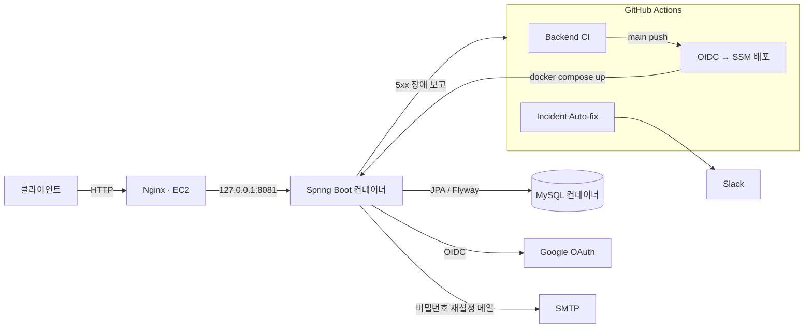
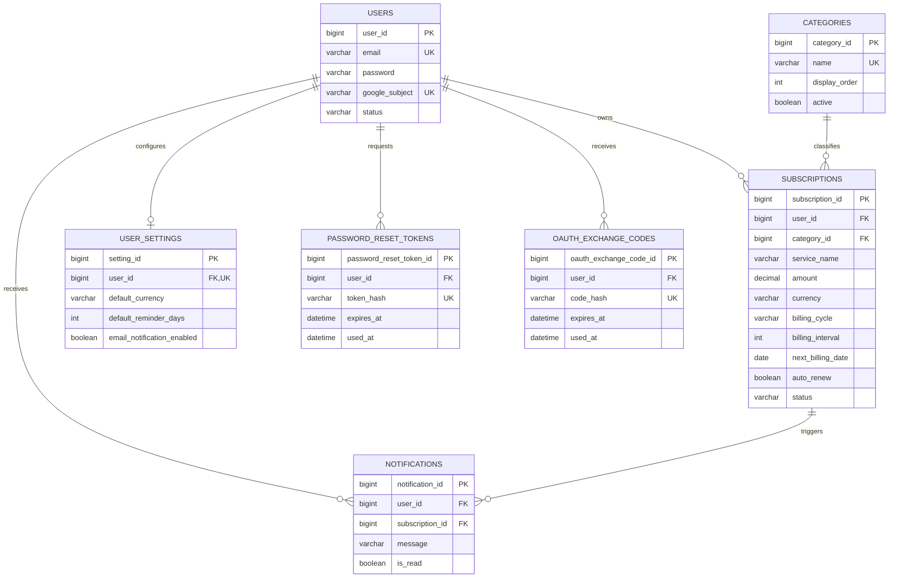
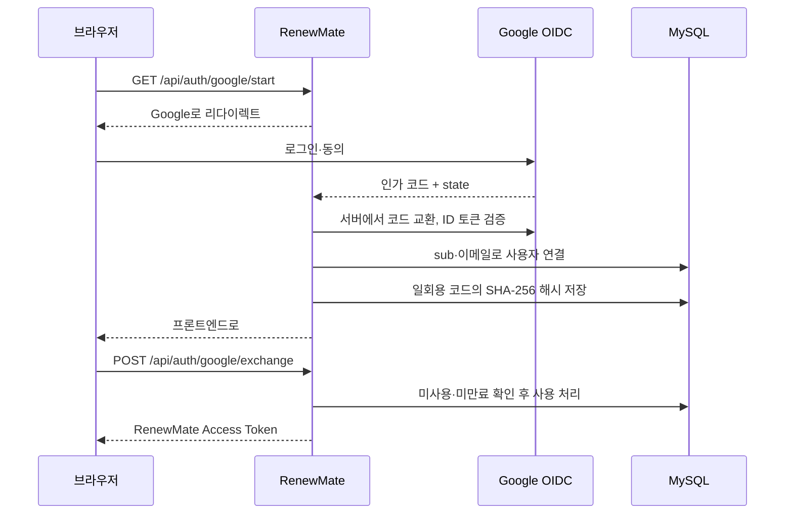
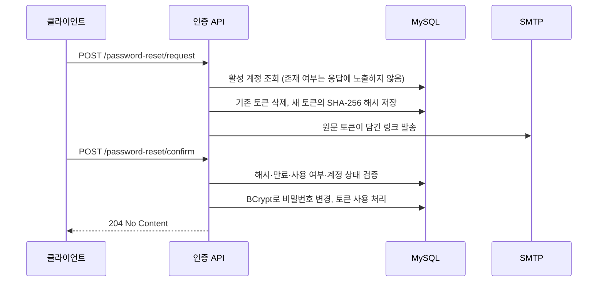
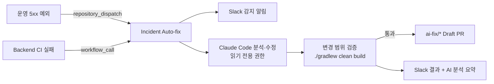

# RenewMate Backend

구독·멤버십의 결제일, 갱신 상태, 월·연 예상 지출을 관리하는 Spring Boot REST API입니다.

인증·보안, 데이터 정합성, 테스트, 성능 측정, AWS 배포, 장애 자동 대응까지 직접 구현하고 검증했습니다.

## 기술 스택

| 영역 | 기술 |
| --- | --- |
| 언어·프레임워크 | Java 21, Spring Boot 4.1, Spring MVC, Spring Security |
| 데이터 | Spring Data JPA, Hibernate, MySQL 8, Flyway |
| 인증 | JWT, OAuth 2.0 Client, OpenID Connect (Google) |
| 테스트·성능 | JUnit 5, Mockito, MockMvc, H2, Hibernate Statistics, k6 |
| 인프라 | Docker Compose, Nginx, AWS EC2, AWS SSM, GitHub Actions (OIDC) |
| 운영 | Actuator, Slack Incoming Webhook, Claude Code (장애 자동 수정) |

## 시스템 아키텍처



- 앱과 MySQL 포트는 EC2 loopback에만 바인딩하고, 외부 요청은 Nginx를 거칩니다.
- GitHub Actions는 장기 AWS 키 없이 OIDC 임시 자격 증명으로 SSM 배포 명령을 실행합니다.

## 주요 기능

| 도메인 | 기능 |
| --- | --- |
| 인증 | 이메일 회원가입·로그인(JWT), Google 로그인(OIDC), 이메일 링크 비밀번호 재설정 |
| 구독 | CRUD, 상태 변경(활성·비활성·해지 예정), 30일 내 결제 예정 조회 |
| 대시보드·통계 | 월·연 예상 지출, 서비스별·카테고리별 지출 |
| 알림 | 결제일 N일 전 알림 생성(조회 시 생성, 중복 방지), 읽음 처리 |
| 사용자 | 내 정보 수정, 비밀번호 변경, 기본 설정(통화·알림일), 비밀번호 확인 후 회원 탈퇴 |
| 운영 | 5xx 장애·CI 실패 시 Slack 알림 → AI 코드 수정 → 빌드 검증 → Draft PR |

<details>
<summary>API 목록</summary>

| 메서드 | 경로 | 설명 | 인증 |
| --- | --- | --- | --- |
| POST | `/api/auth/signup` | 회원가입 | - |
| POST | `/api/auth/login` | 로그인, Access Token 발급 | - |
| GET | `/api/auth/google/start` | Google 로그인 시작 | - |
| POST | `/api/auth/google/exchange` | 일회용 코드 → Access Token 교환 | - |
| POST | `/api/auth/password-reset/request` | 재설정 메일 요청 | - |
| POST | `/api/auth/password-reset/confirm` | 새 비밀번호 확정 | - |
| GET·PATCH·DELETE | `/api/users/me` | 내 정보 조회·수정·탈퇴 | ✅ |
| PATCH | `/api/users/me/password` | 비밀번호 변경 | ✅ |
| GET·POST | `/api/subscriptions` | 구독 목록·등록 | ✅ |
| GET·PUT·DELETE | `/api/subscriptions/{id}` | 구독 단건 조회·수정·삭제 | ✅ |
| PATCH | `/api/subscriptions/{id}/status` | 구독 상태 변경 | ✅ |
| GET | `/api/subscriptions/upcoming` | 결제 예정 구독 | ✅ |
| GET | `/api/dashboard/summary`, `/api/dashboard/upcoming` | 대시보드 요약·결제 예정 | ✅ |
| GET | `/api/statistics/summary`, `/services`, `/categories` | 지출 통계 | ✅ |
| GET | `/api/categories` | 카테고리 목록 | ✅ |
| GET | `/api/notifications` | 알림 목록 | ✅ |
| PATCH | `/api/notifications/{id}/read` | 알림 읽음 처리 | ✅ |
| GET·PUT | `/api/settings` | 사용자 설정 조회·수정 | ✅ |

Swagger UI: `http://localhost:8081/swagger-ui/index.html`

</details>

## ERD



### 스키마·기준 데이터 관리 (Flyway)

| 버전 | 내용 |
| --- | --- |
| V1 | 핵심 테이블 (users, categories, subscriptions, notifications, user_settings) |
| V2 | Google 로그인: `users.google_subject` 컬럼·유니크 제약, OAuth 일회용 코드 테이블 |
| V3 | 비밀번호 재설정 토큰 테이블 |
| V4 | 기본 카테고리 8개 (영상/OTT, 음악, 생산성, 개발, 운동/건강, 교육, 쇼핑/배송, 기타) |

**Flyway를 쓰는 이유**

- **데이터가 있는 운영 DB의 스키마가 계속 바뀝니다.** Google 로그인(V2)과 비밀번호 재설정(V3)을 추가하면서 기존 `users` 테이블에 컬럼과 유니크 제약을 더했습니다. `ddl-auto=update`는 무엇이 언제 적용됐는지 기록하지 않고 제약 변경이나 데이터 이전을 보장하지 않습니다. 변경은 SQL 파일로 PR에서 리뷰하고, 환경별 적용 버전은 `flyway_schema_history`로 확인합니다.
- **이미 운영 중인 DB에 나중에 도입했습니다.** `baseline-on-migrate`와 `baseline-version=2`로 기존 DB는 V2를 기준선으로 삼아 V3부터 적용하고, 새 DB는 V1부터 적용합니다. 어느 쪽이든 최종 스키마는 같습니다.
- **기준 데이터도 코드로 재현합니다.** 카테고리는 DB마다 손으로 넣어 왔기 때문에 새로 만든 DB에서는 카테고리 목록이 비어 있었습니다. V4는 기본 카테고리를 넣되 같은 이름이 있으면 건너뛰어 기존 ID와 구독 연결을 보존합니다.
- **잘못된 상태로는 뜨지 않게 합니다.** Hibernate `ddl-auto=validate`는 엔티티와 스키마가 다르면 기동을 막고, `clean-disabled=true`는 운영 DB 초기화 명령을 차단합니다.

**검증** (로컬 MySQL 8.0, 임시 DB, 2026-10-09)

| 시나리오 | 결과 |
| --- | --- |
| 빈 DB | V1→V4 적용, `validate` 통과, `GET /api/categories`가 8개 반환 |
| Flyway 도입 전 DB (V2 구조 + 수동 입력 카테고리 8개) | V2 기준선 생성 후 V3·V4 적용, 카테고리 중복 없이 8개 유지 |
| 같은 DB 재기동 | `Schema is up to date`, 변경 없음 |

## 인증과 보안

### Google 로그인



- Client Secret과 ID 토큰 검증은 백엔드만 다룹니다. 브라우저에는 60초짜리 일회용 코드만 전달하고, 원문은 DB에 저장하지 않습니다.

### 비밀번호 재설정



### 데이터 정합성과 권한

- 구독 단건 조회·수정·삭제는 `subscriptionId`와 JWT의 `userId`를 함께 조건으로 사용합니다. 다른 사용자의 구독은 존재 여부를 드러내지 않고 `SUBSCRIPTION_NOT_FOUND`를 반환합니다.
- 회원 탈퇴는 비밀번호를 다시 확인한 뒤 재설정 토큰 → OAuth 코드 → 알림 → 구독 → 설정 → 사용자 순서로 한 트랜잭션에서 삭제합니다.
- 오류 응답은 `success`, `errorCode`, `message` 형식으로 통일하고, 스택 트레이스는 클라이언트에 노출하지 않습니다.

## 장애 자동 대응

운영 서버 5xx 장애나 CI 실패가 발생하면 Slack 알림부터 AI 수정 PR까지 자동으로 진행합니다.



| 구분 | 설계 |
| --- | --- |
| 장애 보고 | 처리되지 않은 예외만 보고합니다. 404·405·잘못된 요청 같은 클라이언트 오류는 제외하고, 같은 예외(원인 예외 + 첫 앱 프레임 기준 지문)는 30분에 한 번만 보냅니다. |
| 민감 정보 | 예외 메시지의 이메일·토큰·비밀번호는 마스킹하고 요청 본문·헤더·쿼리는 보내지 않습니다. 서버에는 Slack Webhook이나 AI 키를 두지 않습니다. |
| AI 권한 | AI 단계는 저장소 읽기 권한만 가지고, 파일 읽기·수정 도구만 사용합니다(명령 실행·웹 접근 차단). |
| 변경 제한 | `src/(main\|test)/java/**/*.java` 밖의 변경은 폐기하고, 전체 빌드를 통과한 수정만 별도 job이 Draft PR로 올립니다. 자동 머지는 하지 않습니다. |
| 비용 제어 | 같은 이슈의 PR이 열려 있으면 다시 실행하지 않고, 하루 AI PR 수를 제한합니다. |

**검증 결과**
- CI 실패 리허설: 연간 구독 금액 계산에 넣은 버그를 Claude가 찾아 한 줄 수정했고, 빌드를 통과한 Draft PR이 생성됐습니다.
- 운영 경로 리허설: 존재하지 않는 코드의 가짜 장애를 보내자 "코드 결함 아님"으로 판단해 코드를 수정하지 않고 Slack에 분석만 남겼습니다.

<details>
<summary>설정값</summary>

| 위치 | 이름 | 용도 |
| --- | --- | --- |
| GitHub Secret | `SLACK_WEBHOOK_URL` | Slack Incoming Webhook |
| GitHub Secret | `CLAUDE_CODE_OAUTH_TOKEN` | Claude Pro/Max 구독 토큰 (`claude setup-token`) |
| GitHub Variable | `AI_AUTOFIX_ENABLED` | `true`일 때만 AI 수정 실행 |
| GitHub Variable | `AI_AUTOFIX_DAILY_LIMIT` | 하루 AI PR 상한 (기본 3) |
| GitHub Variable | `AI_FIX_BASE_BRANCH` | 운영 장애 PR 대상 브랜치 (기본 `develop`) |
| EC2 `.env` | `INCIDENT_REPORT_ENABLED`, `INCIDENT_GITHUB_TOKEN` | 장애 보고 on/off, 이 저장소 전용 fine-grained PAT (Contents: Read and write) |

- CI 실패 감지는 Backend CI가 직접 호출하므로 모든 브랜치에서 동작합니다. `incident-test/**` 브랜치에 실패하는 테스트를 push하면 전체 흐름을 리허설할 수 있습니다.
- 운영 5xx 감지와 Actions 탭 수동 실행(Slack 테스트)은 기본 브랜치(main)의 워크플로우로 실행됩니다.

</details>

## 트러블슈팅

| 문제 | 원인 | 해결과 검증 |
| --- | --- | --- |
| 구독 목록 N+1 | LAZY 카테고리를 DTO 변환 중 구독 수만큼 추가 조회 | `join fetch` 적용, Hibernate Statistics 통합 테스트로 SQL 1회 고정 |
| 새 DB에서 카테고리 목록이 비어 있음 | 카테고리 기준 데이터를 DB마다 수동 입력, 스키마 마이그레이션과 분리 | Flyway V4 시드(이름 기준 중복 방지), 빈 DB·기존 DB·재기동 3가지로 검증 |
| GitHub Actions OIDC 인증 실패 | IAM trust policy의 repository/ref subject와 workflow claim 불일치 | OIDC claim을 진단해 main 배포 조건과 역할 신뢰 조건을 일치 |
| SSM 배포 결과가 늦게 확정 | 명령 전송 시점과 Docker 빌드·기동 완료 시점의 차이 | 명령 상태 폴링과 timeout, 배포 후 Actuator 헬스 체크 재시도 |
| Google OAuth 설정 누락 | 운영 컨테이너에 Client ID/Secret 미전달 | Compose 환경변수 전달, 빈 값이면 기동 실패(fail-fast) |
| SMTP 메일 미발송 | Compose에 SMTP 환경변수 미전달 | `MAIL_*` 전달과 `.env.example` 문서화, 발신 계정과 수신 주소 역할 분리 |
| 500 에러가 로그에 남지 않음 | 공통 예외 핸들러가 응답만 만들고 로그를 남기지 않음 | `log.error` 추가, 클라이언트 오류(404·405)는 `warn`으로 분리 |
| AI 수정 액션이 CI에서 실패 | `claude-code-action`이 push 이벤트를 지원하지 않음 (`Unsupported event type: push`) | Claude Code CLI 헤드리스 실행(`claude -p`)으로 교체, AI 단계에서 GitHub 토큰 제거 |
| AI 수정 PR 생성 실패 | 저장소 기본 설정이 Actions의 PR 생성을 차단 | Workflow permissions에서 PR 생성 허용 |
| AI가 CI 로그 없이 분석 | 실패 job 종료 직후라 로그가 아직 업로드되지 않음 | job 로그 조회 API를 최대 1분 재시도 |

## 성능 측정 (k6)

DAU 5,000명 × 하루 20회 요청(평균 1.16 RPS), 피크 10배를 가정해 **15 RPS**를 목표로 잡고, EC2 `t3.micro` 한 대(앱 + MySQL)에서 측정했습니다.

| 시나리오 | 결과 |
| --- | --- |
| 구독 조회 15 RPS, 5분 | 4,501회, 오류 0, p95 57 ms |
| 구독 조회 30 RPS, 1분 | 1,800회, 오류 0, p95 91 ms |
| 활성 VU 100명, 조회 약 15 RPS, 5분 | 4,500회, 오류 0, p95 76 ms |
| 동시 회원가입 100명 | 100/100 성공, p95 4.89 s |
| 동시 로그인 100명 | 100/100 성공, p95 4.91 s |

- 조회는 목표 부하에서 안정적이었고, 동시 인증 100건은 모두 성공했지만 수 초의 대기가 발생했습니다(원인 분석은 남은 과제).
- 시나리오와 원본 결과: [`load-test/`](load-test/) ([조회](load-test/results/2026-10-02-baseline.md), [인증 동시성](load-test/results/2026-10-02-auth-concurrency.md))

## 테스트

| 종류 | 검증 내용 |
| --- | --- |
| 단위 테스트 | 로그인, Google 계정 연결·충돌, OAuth 코드 만료·재사용, 비밀번호 재설정, 회원 정보, 장애 보고(쿨다운·마스킹·클라이언트 오류 제외) |
| API 테스트 (MockMvc) | 미인증 요청 401, 다른 사용자 구독 접근 차단과 공통 오류 응답 |
| JPA 통합 테스트 | 구독 삭제 시 알림 정리, 회원 탈퇴 시 연관 데이터 삭제 |
| 쿼리 회귀 테스트 | 구독 목록 + 카테고리를 SQL 1회로 조회 |

```bash
./gradlew clean build
```

## CI/CD

- **CI**: main·develop push와 PR에서 `./gradlew clean build`를 실행하고, 실패하면 장애 자동 대응을 호출합니다.
- **CD**: main push에서 CI가 성공하면 AWS OIDC → SSM으로 EC2에서 `docker compose up -d --build`를 실행하고, Actuator 헬스 체크가 `UP`일 때까지 확인합니다.

## 로컬 실행

1. `src/main/resources/application-local.properties`를 만듭니다(Git 제외).

    ```properties
    spring.datasource.url=jdbc:mysql://localhost:3306/renewmate
    spring.datasource.username=<user>
    spring.datasource.password=<password>
    spring.datasource.driver-class-name=com.mysql.cj.jdbc.Driver
    server.port=8081
    jwt.secret=<32바이트 이상 비밀값>
    jwt.access-token-expiration=3600000
    ```

2. 실행합니다.

    ```bash
    ./gradlew bootRun
    ```

Docker Compose로 실행할 때는 [`.env.example`](.env.example)을 복사해 `.env`를 만든 뒤 `docker compose up -d --build`를 실행합니다. 환경변수 전체 목록과 설명은 `.env.example`에 있습니다.

## 남은 과제

- 외부 HTTPS 도메인·인증서 적용과 운영 SMTP·Google redirect URI 검증
- Refresh Token 발급·회전·폐기
- 통계 API의 카테고리 N+1 해결과 캐시 적용
- 마이그레이션을 CI에서 실제 MySQL로 검증 (현재 테스트는 H2 + `ddl-auto=create-drop`이라 Flyway를 거치지 않음)
- 비밀번호 재설정 메일의 비동기 발송·재시도
- 동시 인증 요청 지연(p95 약 4.9초)의 원인 분석
