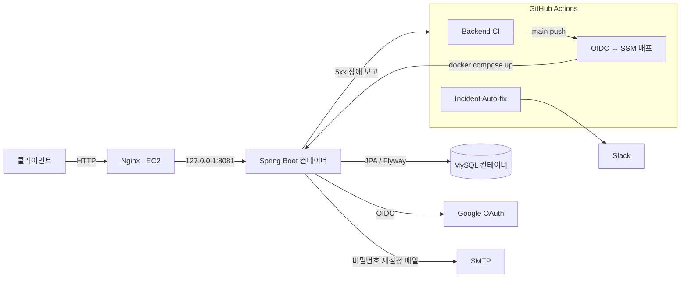
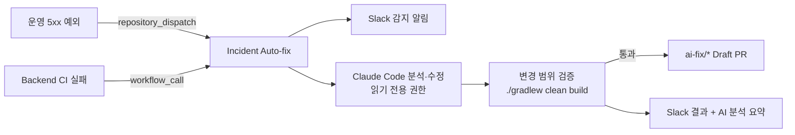
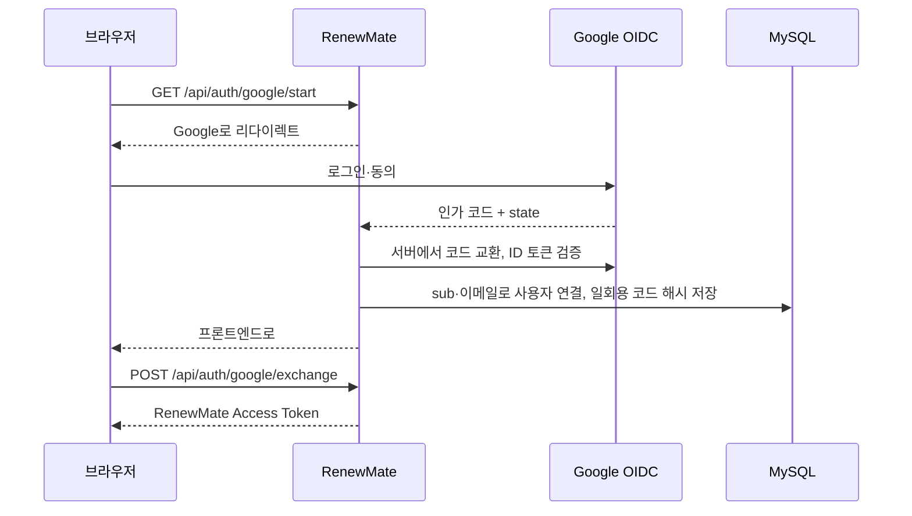

# RenewMate Backend

구독·멤버십의 결제일, 갱신 상태, 월·연 예상 지출을 관리하는 Spring Boot REST API입니다.

**핵심 성과**
- **N+1 제거와 캐시**: 통계·결제 예정 조회의 SQL을 4회에서 1회로 줄였습니다. 반복 조회는 Caffeine 캐시로 0회입니다.
- **장애 자동 대응**: 운영 5xx·CI 실패가 나면 Slack 알림 → AI 분석·수정 → 빌드 검증 → Draft PR까지 자동으로 진행합니다. 리허설에서 일부러 넣은 버그를 AI가 찾아 한 줄로 수정했습니다.
- **성능 측정**: EC2 `t3.micro` 한 대에서 목표 15 RPS 조회를 오류 0건, p95 57 ms로 처리했습니다.
- **안전한 운영**: 운영 중인 DB에 Flyway를 도입해 스키마와 기준 데이터를 버전으로 관리합니다. 배포는 장기 AWS 키 없이 OIDC로 합니다.

## 기술 스택

| 영역 | 기술 |
| --- | --- |
| 언어·프레임워크 | Java 21, Spring Boot 4.1, Spring MVC, Spring Security |
| 데이터 | Spring Data JPA, Hibernate, MySQL 8, Flyway, Caffeine |
| 인증 | JWT, OAuth 2.0 Client, OpenID Connect (Google) |
| 테스트·성능 | JUnit 5, Mockito, MockMvc, H2, Hibernate Statistics, k6 |
| 인프라 | Docker Compose, Nginx, AWS EC2, AWS SSM, GitHub Actions (OIDC) |
| 운영 | Actuator, Slack Incoming Webhook, Claude Code (장애 자동 수정) |

## 시스템 아키텍처



- 앱과 MySQL 포트는 EC2 loopback에만 바인딩하고, 외부 요청은 Nginx를 거칩니다.
- **CI**: PR과 main·develop push마다 `./gradlew clean build`를 실행하고, 실패하면 장애 자동 대응을 호출합니다.
- **CD**: main push에서 OIDC 임시 자격 증명 → SSM으로 EC2에서 `docker compose up -d --build`를 실행하고, Actuator 헬스 체크가 `UP`일 때까지 확인합니다.

## 주요 기능

| 도메인 | 기능 |
| --- | --- |
| 인증 | 이메일 회원가입·로그인(JWT), Google 로그인(OIDC), 이메일 링크 비밀번호 재설정 |
| 구독 | CRUD, 상태 변경(활성·비활성·해지 예정), 결제 예정 조회 |
| 대시보드·통계 | 통화별 월·연 예상 지출, 서비스별·카테고리별 지출 |
| 알림 | 결제일 N일 전 알림, 읽음 처리 |
| 사용자 | 정보 수정, 비밀번호 변경, 기본 설정, 비밀번호 확인 후 회원 탈퇴 |

<details>
<summary>API 목록</summary>

| 메서드 | 경로 | 설명 | 인증 |
| --- | --- | --- | --- |
| POST | `/api/auth/signup`, `/api/auth/login` | 회원가입, 로그인 | - |
| GET·POST | `/api/auth/google/start`, `/api/auth/google/exchange` | Google 로그인 시작, 일회용 코드 → 토큰 교환 | - |
| POST | `/api/auth/password-reset/request`, `/confirm` | 재설정 메일 요청, 새 비밀번호 확정 | - |
| GET·PATCH·DELETE | `/api/users/me`, `PATCH /api/users/me/password` | 내 정보 조회·수정·탈퇴, 비밀번호 변경 | ✅ |
| GET·POST·PUT·DELETE | `/api/subscriptions`, `/{id}`, `PATCH /{id}/status`, `/upcoming` | 구독 CRUD, 상태 변경, 결제 예정 | ✅ |
| GET | `/api/dashboard/summary`, `/upcoming` | 대시보드 요약·결제 예정 | ✅ |
| GET | `/api/statistics/summary`, `/services`, `/categories` | 지출 통계 | ✅ |
| GET | `/api/categories`, `/api/notifications` · PATCH `/api/notifications/{id}/read` | 카테고리, 알림 | ✅ |
| GET·PUT | `/api/settings` | 사용자 설정 | ✅ |

Swagger UI: `http://localhost:8081/swagger-ui/index.html`

</details>

## 핵심 문제 해결

### 1. 통계 조회 N+1과 반복 계산

- **문제**: 통계·대시보드는 화면에 들어올 때마다 활성 구독 전체를 월 단위로 환산해 다시 계산했습니다. 카테고리별 통계와 결제 예정 목록은 카테고리를 구독마다 따로 조회했습니다.
- **원인**: LAZY로 연관된 카테고리를 응답 DTO로 변환하면서 추가 SQL이 발생했습니다. 결과는 구독이 바뀔 때만 달라지는데도 매번 다시 계산했습니다.
- **해결**:
  - `left join fetch`로 한 번에 조회하고, 정렬은 DB에서 합니다.
  - 사용자별 Caffeine 캐시를 두고, 구독이 변경되면 **트랜잭션 커밋 후** 캐시를 비웁니다 (`TransactionAwareCacheManagerProxy`). 커밋 전에 비우면 그 사이 다른 요청이 변경 전 데이터를 다시 캐시할 수 있어서입니다.
  - 서버가 EC2 한 대라 Redis 없이 로컬 캐시로 충분합니다.
- **결과**: Hibernate Statistics 기반 회귀 테스트로 고정했습니다.

| 조회 | 개선 전 | 개선 후 |
| --- | --- | --- |
| 카테고리별 통계 (카테고리 3개) | SQL 4회 | 1회 |
| 결제 예정 목록 (구독 3개) | SQL 4회 | 1회 |
| 통계·대시보드 요약 재조회 | SQL 3회 | 0회 |

함께 고친 것: 통화가 다른 금액을 단순 합산하던 문제를 **통화별 합산**으로 바꿨습니다. 예를 들어 `{KRW: 17,000, USD: 8.33}`처럼 반환합니다.

### 2. 장애 자동 대응: Slack 알림부터 AI 수정 PR까지



- **알림 폭주 방지**: 같은 예외는 지문 기준으로 30분에 한 번만 보고합니다. 같은 이슈의 PR이 열려 있으면 다시 실행하지 않고, 하루 AI PR 수에 상한을 둡니다.
- **안전장치**:
  - 예외 메시지의 이메일·토큰·비밀번호는 마스킹합니다. 서버에는 Slack이나 AI 키를 두지 않습니다.
  - AI는 저장소 읽기 권한과 파일 수정 도구만 사용합니다.
  - Java 소스 밖의 변경은 폐기하고, 빌드를 통과한 수정만 Draft PR로 올립니다. 자동 머지는 하지 않습니다.
- **리허설 결과**:
  - CI에 일부러 넣은 금액 계산 버그를 AI가 찾아 한 줄 수정했고, Draft PR이 생성됐습니다.
  - 코드 결함이 아닌 가짜 장애에는 코드를 고치지 않고 Slack에 분석만 남겼습니다.

### 3. 클라이언트 실수가 장애 알림을 울리던 문제

- **문제**: 전체 API 테스트에서 잘못된 요청 4종이 모두 500으로 응답했습니다 (파라미터 범위 위반, 깨진 JSON, 없는 경로, 미지원 메서드). 특히 `?days=0`은 장애로 보고돼 **운영에서 Slack 알림과 AI 수정이 실행될 수 있는 상태**였습니다.
- **원인**: 공통 예외 핸들러에 `ConstraintViolationException` 처리가 없었고, 클라이언트 오류로 분류한 예외도 500으로 응답했습니다.
- **해결**: 클라이언트 오류를 각자의 상태 코드(400·404·405)로 응답하고, 장애 보고 대상에서 뺐습니다.
- **결과**: 4가지 경우의 응답 코드와 장애 미보고를 MockMvc 테스트로 검증합니다.

### 4. 운영 중인 DB에 Flyway 도입

- **문제**: 데이터가 있는 운영 DB에 Google 로그인과 비밀번호 재설정을 추가하면서 스키마가 계속 바뀌었습니다. 카테고리 같은 기준 데이터는 DB마다 손으로 넣어서, 새 DB에서는 카테고리 목록이 비어 있었습니다.
- **해결**:
  - 변경은 SQL 파일(V1~V4)로 PR에서 리뷰합니다.
  - 기존 DB는 `baseline-version=2`로 기준선을 잡아 V3부터 적용하고, 새 DB는 V1부터 적용합니다.
  - 기준 데이터(V4)는 같은 이름이 있으면 건너뛰어 기존 ID를 보존합니다.
  - `ddl-auto=validate`로 엔티티와 스키마가 다르면 기동을 막고, `clean-disabled=true`로 운영 DB 초기화를 막습니다.
- **결과**: MySQL 8에서 빈 DB, Flyway 도입 전 DB, 재기동 세 경우 모두 같은 최종 상태가 되는 것을 확인했습니다.

<details>
<summary>인증 설계</summary>

- **Google 로그인**:
  - Client Secret과 ID 토큰 검증은 백엔드에서만 다룹니다.
  - 브라우저에는 60초짜리 일회용 코드만 전달하고, DB에는 그 SHA-256 해시만 저장합니다.
  - 코드는 한 번 쓰면 다시 쓸 수 없습니다.
- **비밀번호 재설정**:
  - 계정이 있는지는 응답에 드러내지 않습니다.
  - 토큰은 해시로 저장하고, 만료·사용 여부·계정 상태를 확인한 뒤에 변경합니다.
- **권한**: 구독 조회·수정·삭제는 `subscriptionId`와 JWT의 `userId`를 함께 조건으로 사용해, 다른 사용자의 데이터가 있는지조차 드러내지 않습니다.



</details>

## 성능 측정 (k6)

DAU 5,000명 × 하루 20회 요청을 가정했습니다. 평균 1.16 RPS에 피크 10배를 잡아 **15 RPS**를 목표로 정했고, EC2 `t3.micro` 한 대(앱 + MySQL)에서 측정했습니다.

| 시나리오 | 결과 |
| --- | --- |
| 구독 조회 15 RPS, 5분 | 4,501회, 오류 0, p95 57 ms |
| 구독 조회 30 RPS, 1분 | 1,800회, 오류 0, p95 91 ms |
| 동시 회원가입·로그인 100명 | 100/100 성공, p95 약 4.9 s |

- 조회는 목표 부하에서 안정적이었습니다. 동시 인증은 모두 성공했지만 수 초의 대기가 생겨 원인을 분석하고 있습니다.
- 시나리오와 원본 결과: [`load-test/`](load-test/)

## 트러블슈팅

| 문제 | 원인 | 해결 |
| --- | --- | --- |
| GitHub Actions OIDC 인증 실패 | IAM trust policy의 subject와 workflow claim 불일치 | claim을 진단해 배포 조건과 역할 신뢰 조건을 일치 |
| SSM 배포 결과가 늦게 확정 | 명령 전송 시점과 컨테이너 기동 완료 시점의 차이 | 명령 상태 폴링과 timeout, 헬스 체크 재시도 |
| 운영에서 Google 로그인 실패 | 컨테이너에 OAuth 환경변수 미전달 | 환경변수 전달, 값이 비면 기동 실패(fail-fast) |
| AI 수정 액션이 CI에서 실패 | `claude-code-action`이 push 이벤트 미지원 | Claude Code CLI 헤드리스 실행으로 교체 |
| AI가 CI 로그 없이 분석 | 실패 직후라 job 로그가 아직 업로드되지 않음 | 로그 조회 API를 최대 1분 재시도 |

## 테스트

단위·MockMvc·JPA 통합 테스트 52개가 있습니다.
- 인증과 권한
- 회원 탈퇴 시 연관 데이터 삭제
- SQL 횟수 회귀 (Hibernate Statistics)
- 캐시 적중과 무효화
- 통화별 집계
- 클라이언트 오류 응답
- 장애 보고 쿨다운·마스킹

```bash
./gradlew clean build
```

## 로컬 실행

1. `src/main/resources/application-local.properties`에 MySQL 접속 정보와 `jwt.secret`을 넣습니다 (Git 제외).
2. `./gradlew bootRun`으로 실행합니다.
3. Docker Compose로 실행하려면 [`.env.example`](.env.example)을 `.env`로 복사한 뒤 `docker compose up -d --build`를 실행합니다.

## 남은 과제

- 동시 인증 요청 지연(p95 약 4.9초)의 원인 분석과 개선
- 비밀번호 재설정 메일의 비동기 발송·재시도
- Refresh Token 발급·회전·폐기
- 외부 HTTPS 도메인 적용, 마이그레이션의 실제 MySQL CI 검증
