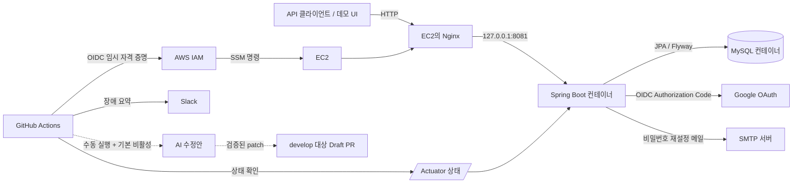
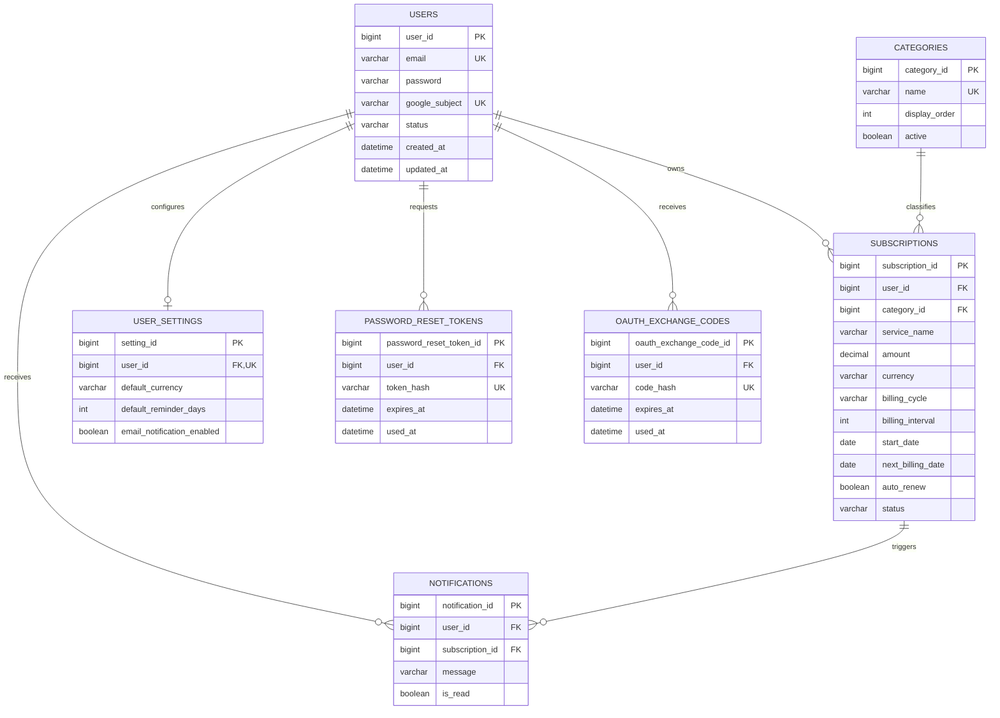
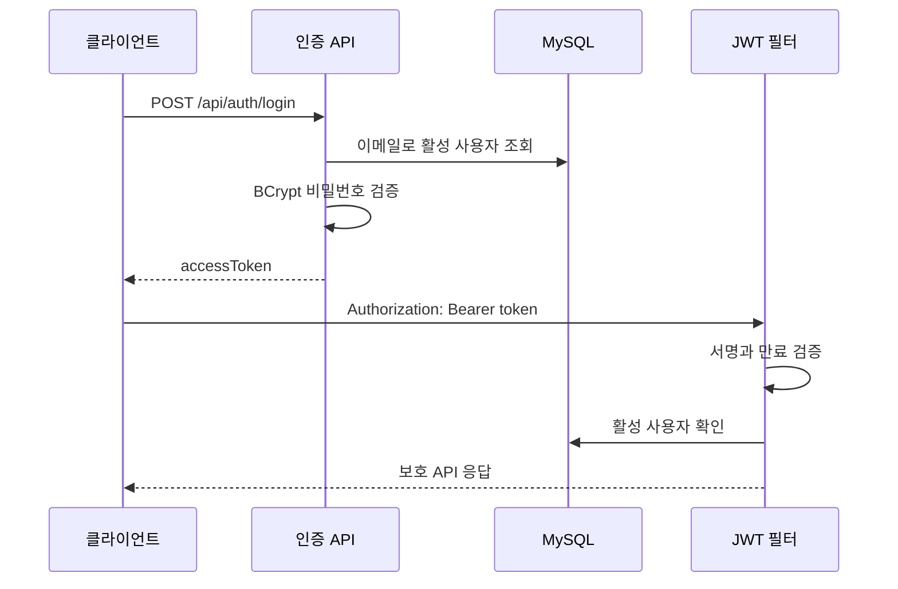
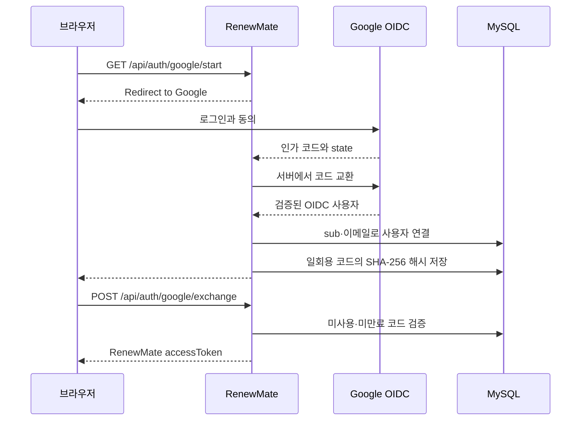
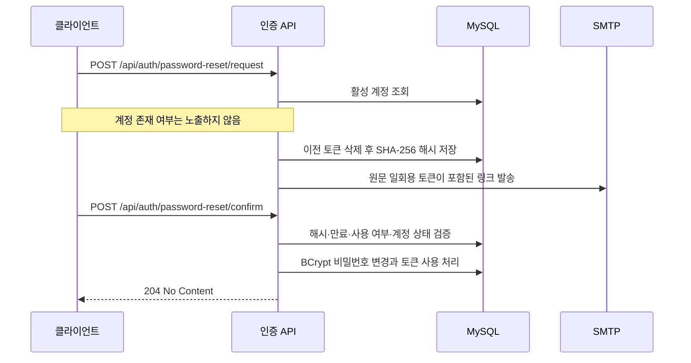
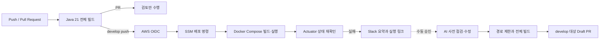

# RenewMate 백엔드

반복 결제와 멤버십의 결제일, 갱신 상태, 예상 지출을 관리하는 Spring Boot REST API입니다. 이 저장소는 기능 수보다 **인증·보안, 데이터 정합성, 테스트, 성능 검증, AWS 배포와 장애 대응 자동화**를 실제 코드와 재현 가능한 자료로 보여주는 백엔드 포트폴리오에 초점을 둡니다.

프론트엔드는 API 확인용 별도 데모이며 이 저장소의 범위에 포함하지 않습니다.

## 핵심 기능

- 이메일 회원가입·로그인과 JWT Bearer 인증
- Google OAuth 2.0 Authorization Code + OIDC 로그인 후 RenewMate JWT 발급
- 이메일 링크 기반 비밀번호 재설정: 원문 토큰 미저장, 만료·재사용 차단
- 사용자별 구독 CRUD, 상태 변경, 결제 예정 조회
- 월간·연간 예상 지출 및 서비스·카테고리별 통계
- 알림 읽음 처리와 사용자 기본 설정
- 본인 확인 후 회원과 구독·알림·설정·인증 토큰 데이터 삭제
- Flyway 스키마 버전 관리와 Hibernate schema validation
- GitHub Actions CI, AWS OIDC·SSM 기반 EC2 배포, Actuator 헬스 체크
- Slack 장애 알림과 승인형 AI Draft PR 자동화

## 기술 스택

| 영역 | 기술 |
| --- | --- |
| 언어·런타임 | Java 21 |
| 프레임워크 | Spring Boot 4.1.0, Spring MVC, Spring Security |
| 데이터 | Spring Data JPA, Hibernate, MySQL 8, Flyway |
| 인증 | JWT, OAuth 2.0 Client, OpenID Connect |
| 메일 | Spring Mail, SMTP |
| 테스트 | JUnit 5, Mockito, MockMvc, H2, Hibernate Statistics |
| 성능 측정 | k6, MySQL `EXPLAIN ANALYZE` |
| 인프라 | Docker Compose, Nginx, AWS EC2, AWS SSM, GitHub Actions OIDC |
| 운영 자동화 | Actuator, Slack Incoming Webhook, 승인형 Codex Draft PR 작업 |

## 시스템 아키텍처



- MySQL과 애플리케이션 포트는 Docker 호스트의 loopback에만 바인딩합니다.
- GitHub Actions는 장기 AWS 키 대신 OIDC로 임시 자격 증명을 받아 SSM 명령을 실행합니다.
- AI 자동 수정은 장애 발생만으로 실행되지 않으며, 명시적 수동 실행·횟수 제한·별도 빌드 검증 후 Draft PR만 만듭니다.

## ERD

아래 관계는 실제 JPA Entity와 Flyway migration을 기준으로 작성했습니다.



## 인증 흐름

### 이메일 로그인과 JWT



Access Token만 사용하므로 토큰이 만료되거나 사용자가 비활성화되면 다시 로그인해야 합니다. Refresh Token은 아직 구현하지 않았습니다.

### Google OAuth 로그인



Google Client Secret과 ID token 검증은 브라우저가 아니라 백엔드가 담당합니다. 일회용 코드 원문은 DB에 저장하지 않고 기본 60초 후 만료되며 한 번만 사용할 수 있습니다. 자세한 설정은 [`docs/google-oauth.md`](docs/google-oauth.md)에 있습니다.

### 비밀번호 재설정



메일 발송이 실패하면 해당 재설정 토큰을 삭제합니다. SMTP 계정은 보내는 서버 설정이고, 수신 주소는 가입한 사용자의 이메일에서 매 요청마다 결정됩니다.

## 데이터 정합성과 권한

- 모든 구독 단건 조회·수정·삭제는 `subscriptionId`와 JWT의 `userId`를 함께 조건으로 사용합니다.
- 다른 사용자의 구독 ID를 요청하면 데이터 존재 여부를 드러내지 않고 `SUBSCRIPTION_NOT_FOUND`를 반환합니다.
- 구독 삭제 시 참조 알림을 먼저 삭제해 FK 오류를 방지합니다.
- 회원 탈퇴는 비밀번호를 다시 확인하고 재설정 토큰 → OAuth 코드 → 알림 → 구독 → 설정 → 사용자 순서로 한 트랜잭션에서 삭제합니다.
- API 예외 응답은 `success`, `errorCode`, `message` 형식을 유지하며 내부 스택 트레이스는 노출하지 않습니다.

## 성능 개선: 구독 목록 N+1 제거

### 문제 → 원인 → 해결 → 검증 → 결과

1. **문제:** 1,000건 구독 목록에서 응답 DTO를 만들 때 목록 데이터 SQL이 21회 발생했습니다.
2. **원인:** `Subscription.category`가 LAZY이고, 20개 카테고리를 DTO 변환 시 각각 조회했습니다.
3. **해결:** 목록 전용 JPQL `join fetch`로 구독과 카테고리를 한 번에 조회했습니다. 이미 존재하지만 선택도가 없는 인덱스를 중복 추가하지 않았습니다.
4. **검증:** 동일한 로컬 MySQL 데이터, 10 VU, 30초 조건으로 개선 전·후 각 5회 k6 측정하고 실제 `EXPLAIN ANALYZE`를 저장했습니다. Hibernate Statistics 통합 테스트로 현재 SQL 1회를 검증합니다.
5. **결과:** 5회 중앙값 기준 p95 16.26% 감소, RPS 12.74% 증가, 실패율 0%를 확인했습니다.

| 지표 | 개선 전 중앙값 | 개선 후 중앙값 | 변화 |
| --- | ---: | ---: | ---: |
| p50 | 28.00 ms | 24.63 ms | 12.05% 감소 |
| 평균 응답 시간 | 28.11 ms | 24.90 ms | 11.41% 감소 |
| p95 | 34.85 ms | 29.19 ms | 16.26% 감소 |
| 처리량 | 352.99 RPS | 397.97 RPS | 12.74% 증가 |
| 실패율 | 0% | 0% | 동일 |
| 목록 데이터 SQL | 21회 | 1회 | 95.24% 감소 |

측정 조건, 10개 원본 k6 JSON, 집계 스크립트, 실행 계획은 [`performance/README.md`](performance/README.md)에 있습니다. 운영 EC2와 운영 DB에는 부하를 주지 않았습니다.

## CI/CD와 장애 대응



- CI는 모든 `main`/`develop` push와 PR에서 `./gradlew clean build`를 실행합니다.
- 배포는 `develop` push의 CI 성공 시에만 실행되며, AWS OIDC와 SSM을 사용합니다.
- 배포 후 EC2 내부 `127.0.0.1:8081/actuator/health`를 재시도합니다.
- Slack 메시지에는 요약과 실행 링크만 보내고 원시 로그·요청 본문·비밀값은 보내지 않습니다.
- AI autofix는 기본 비활성, 수동 실행, 일/월 횟수 제한, Java 경로 제한, 자동 merge 금지입니다.

저장소에서 확인 가능한 근거와 외부 증빙 체크리스트는 [`docs/portfolio-evidence.md`](docs/portfolio-evidence.md)에 있습니다.

## 테스트 전략

| 계층 | 검증 내용 |
| --- | --- |
| 서비스 단위 테스트 | 로그인, Google 계정 연결·충돌, OAuth 코드 사용·만료, 비밀번호 재설정 발급·만료·재사용 |
| MockMvc API 테스트 | 미인증 요청 401, 타 사용자 구독 접근 차단과 공통 오류 응답 |
| JPA 통합 테스트 | 구독 삭제 시 알림 삭제, 회원 탈퇴 연관 데이터 삭제 |
| 쿼리 회귀 테스트 | 구독 목록과 카테고리를 SQL 1회로 조회 |
| 마이그레이션 검증 | 신규 DB V1~V3, 기존 V2 DB baseline 후 V3, Hibernate `validate`, Actuator `UP` |
| 자동화 테스트 | Slack URL 검증, 로그 마스킹, AI 실행 조건·patch 경로 검사 Python 단위 테스트 |

```powershell
.\gradlew.bat clean build
python -B -m unittest discover -s ops/automation -p 'test_*.py' -v
```

## 대표 트러블슈팅

| 문제 | 원인 분석 | 해결과 검증 |
| --- | --- | --- |
| 구독 삭제 FK 오류 | 알림이 삭제 대상 구독을 참조 | 참조 알림을 먼저 삭제하고 트랜잭션 통합 테스트로 구독·알림 삭제 확인 |
| 목록 조회 N+1 | LAZY 카테고리를 DTO 변환 중 반복 조회 | fetch join 적용, k6 5회 비교, SQL 1회 회귀 테스트 |
| GitHub Actions OIDC 인증 실패 | IAM trust policy의 repository/ref subject와 workflow claim 불일치 | OIDC claim 진단 후 develop 배포 조건과 역할 신뢰 조건 정렬 |
| SSM 배포 결과가 늦게 확정 | 명령 전송과 실제 Docker 빌드·기동 완료 시점 차이 | workflow timeout과 명령 상태 대기, 이후 Actuator 재시도 추가 |
| Google OAuth 설정 누락 | 운영 컨테이너에 Client ID/Secret 전달 누락 | Docker 환경변수 전달, 빈 값이면 시작 실패하도록 fail-fast 구성 |
| SMTP 메일 미발송 | Docker Compose에 SMTP 환경변수 전달 누락 | `MAIL_*` 전달과 `.env.example` 문서화, 발신 계정과 수신 사용자 주소 역할 분리 |
| 운영 스키마 자동 변경 위험 | `ddl-auto=update`가 애플리케이션 시작 시 DB를 암묵적으로 수정 | Flyway V1~V3와 baseline 전략 도입, 운영은 `ddl-auto=validate`로 전환 |

GitHub·Slack·AWS 화면 증빙은 저장소 밖 자료이므로 실제 링크와 캡처를 별도로 추가해야 합니다.

## 로컬 실행

### 1. 로컬 설정

`src/main/resources/application-local.properties`는 Git에서 제외됩니다. 다음 형식으로 직접 준비합니다.

```properties
spring.datasource.url=jdbc:mysql://localhost:3306/renewmate
spring.datasource.username=<local-user>
spring.datasource.password=<local-password>
spring.datasource.driver-class-name=com.mysql.cj.jdbc.Driver
server.port=8081
jwt.secret=<at-least-32-byte-secret>
jwt.access-token-expiration=3600000
```

Google OAuth 또는 실제 SMTP를 사용할 때만 해당 환경변수를 추가합니다. 환경변수 목록은 [`.env.example`](.env.example)을 기준으로 합니다.

### 2. 실행

```powershell
.\gradlew.bat bootRun
```

Swagger UI: `http://localhost:8081/swagger-ui/index.html`

Docker Compose로 실행할 때는 `.env.example`을 참고해 로컬 `.env`를 만들고 비밀값을 Git에 추가하지 않습니다.

```powershell
docker compose up -d --build
```

`docker compose down -v`는 MySQL named volume의 데이터를 삭제하므로 사용하지 않습니다.

## 필수 환경변수

| 변수 | 용도 | 비고 |
| --- | --- | --- |
| `DB_URL`, `DB_USERNAME`, `DB_PASSWORD` | 운영 datasource | 필수 |
| `JWT_SECRET` | JWT HMAC key | 최소 32 bytes 권장, 필수 |
| `JWT_ACCESS_TOKEN_EXPIRATION` | Access Token ms | 기본 3,600,000 |
| `GOOGLE_CLIENT_ID`, `GOOGLE_CLIENT_SECRET` | Google server-side OAuth | Google 로그인 사용 시 필수 |
| `FRONTEND_BASE_URL` | OAuth callback·reset link 대상 UI | 기본 local demo URL |
| `MAIL_HOST`, `MAIL_PORT` | SMTP server | 기본 Gmail host/587 |
| `MAIL_USERNAME`, `MAIL_PASSWORD`, `MAIL_FROM` | SMTP 인증·발신자 | 비밀번호는 앱 비밀번호 사용 |
| `PASSWORD_RESET_EXPIRATION_MINUTES` | reset token lifetime | 기본 30 |
| `OAUTH_EXCHANGE_CODE_EXPIRATION_SECONDS` | OAuth one-time code lifetime | 기본 60 |

GitHub Actions용 `SLACK_WEBHOOK_URL`, `OPENAI_API_KEY`, AWS 역할·인스턴스 값은 애플리케이션 환경변수와 분리해 GitHub Secret/Variable로 관리합니다.

## 환경 분리와 DB 마이그레이션

- `application.properties`: 공통 환경변수 바인딩과 Flyway/Hibernate validation 정책
- `application-local.properties`: 로컬 DB/JWT 비밀값, Git 제외
- `application-prod.properties`: 운영 datasource, Flyway, Hibernate validation
- `application-test.properties`: H2 `create-drop`, Flyway 비활성
- `db/migration`: V1 core → V2 Google OAuth → V3 password reset

기존 운영 DB에 Flyway를 적용하는 절차와 안전 조건은 [`docs/flyway-migration-plan.md`](docs/flyway-migration-plan.md)에 있습니다. 이 작업에서는 운영 DB 적용·배포를 수행하지 않았습니다.

## 남은 개선 과제

- Refresh Token·회전·폐기 정책은 아직 없습니다.
- 카테고리 기준 데이터는 schema migration과 분리되어 있어 초기 운영 데이터 절차를 정해야 합니다.
- 목록 이외의 통계·다가오는 결제 API는 데이터 규모가 커질 때 DB 집계·페이지네이션과 추가 SQL 측정이 필요합니다.
- 외부 HTTPS 도메인, 인증서, 실제 SMTP 수신, Google 운영 redirect URI는 배포 환경에서 별도 검증해야 합니다.
- AI autofix는 포트폴리오용 승인형 안전장치이며 무인 운영 복구 시스템이 아닙니다.
